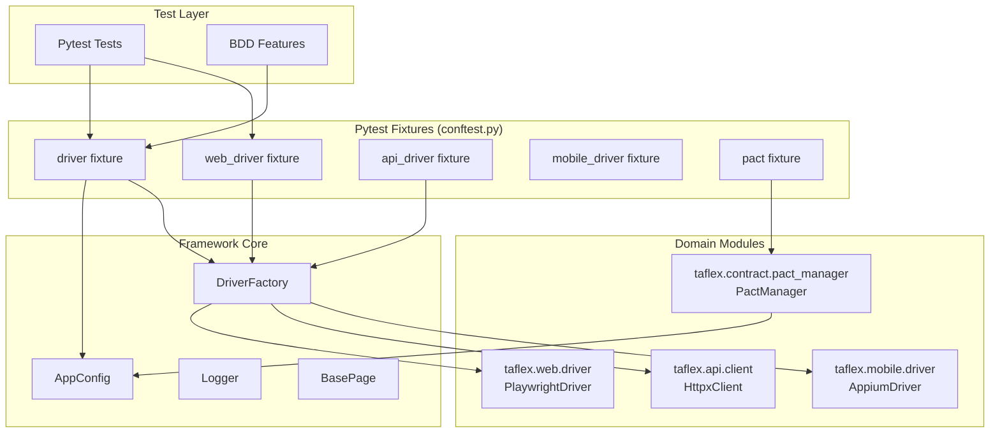
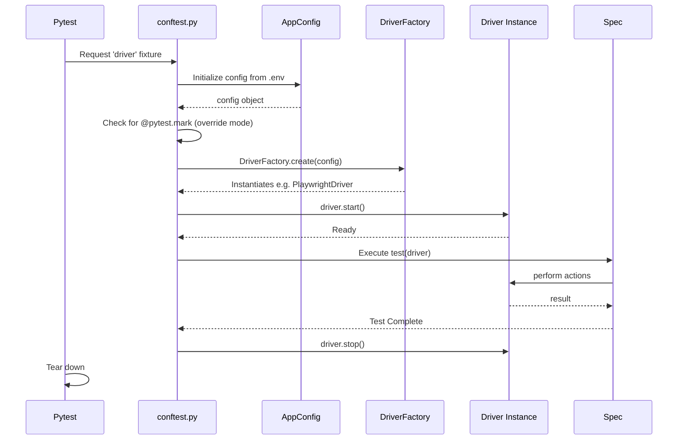

# Architecture Overview

TAFLEX PY Modular is built on a robust, extensible, and modular architecture. This document explains the architectural decisions and how different components interact in the current implementation.

## Design Philosophy

TAFLEX PY follows these core principles:

| Principle | Description |
|-----------|-------------|
| **🧩 Modular Design** | The framework is split into `core`, `web`, `api`, `mobile`, and `contract` modules. Teams only install what they need. |
| **🏭 Factory Pattern** | Runtime driver resolution uses a Factory Pattern to instantiate the correct driver based on `.env` or `@pytest.mark.*`. |
| **⚙️ Configuration Over Code** | Behavior is controlled through a strongly-typed Pydantic `AppConfig` class populated by `.env` variables. |
| **🧪 Native Pytest Integration** | Heavily leverages Pytest fixtures (`conftest.py`) to handle driver lifecycle and dependency injection. |

## High-Level Architecture

## Component Breakdown

### 1. Framework Core (`taflex.core`)
The foundation of the framework. Contains:
*   **`AppConfig`**: A Pydantic BaseSettings class that loads environment variables and provides type safety for configuration.
*   **`DriverFactory`**: Implements the Factory Pattern. Based on the `execution_mode`, it imports and instantiates the correct driver (`PlaywrightDriver`, `HttpxClient`, or `AppiumDriver`).
*   **`conftest.py`**: Contains all global fixtures (`driver`, `web_driver`, `api_driver`, `mobile_driver`, `pact`). It handles the lifecycle (start/stop) of the drivers.
*   **`BasePage`**: An abstract foundation for Page Object Models, used by web and mobile layers.
*   **`logger`**: Standardized logging utility.

### 2. Driver Modules
The framework employs specific interface implementations for different testing domains:

*   **`taflex.web`**: Wraps Playwright. Provides the `PlaywrightDriver` class.
*   **`taflex.api`**: Wraps HTTPX. Provides the `HttpxClient` class.
*   **`taflex.mobile`**: Wraps Appium. Provides the `AppiumDriver` class.

**Key Benefits:**
- ✅ **Lazy Loading**: Specific driver packages (e.g., `playwright`, `appium`) are only imported when explicitly requested by the Factory.
- ✅ **Clean Boundaries**: Web logic doesn't leak into the API module.

### 3. Pytest Markers and Overrides
The `driver` fixture intelligently inspects the test for specific markers (`@pytest.mark.web`, `@pytest.mark.api`, `@pytest.mark.mobile`) using `request.node.get_closest_marker()`. If a marker is found, it overrides the global `EXECUTION_MODE` from the `.env` file just for that test.

### 4. Test Execution Flow

## Technology Stack

| Category | Technologies |
|----------|-------------|
| **Core Framework** | Python 3.10+, Pydantic, Pytest |
| **Web Testing** | Playwright (`pytest-playwright`) |
| **API Testing** | HTTPX |
| **Mobile Testing** | Appium (`Appium-Python-Client`) |
| **Contract Testing** | Pact (`pact-python`) |
| **Reporting** | Allure, ReportPortal, Jira Xray, Pytest-HTML |

## Extensibility Points

TAFLEX PY Modular is designed for extension:

### 1. New Driver Modules
To add a new platform (e.g., Desktop Apps), create a new module `taflex.desktop`, implement a driver class extending `UiDriver`, and update `DriverFactory.create()` to handle the new execution mode.

### 2. Custom Fixtures
Add project-specific fixtures in your repository's `tests/conftest.py`, leveraging the core fixtures provided by the framework template.
